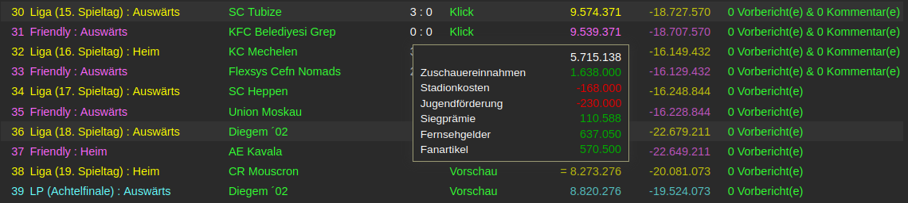
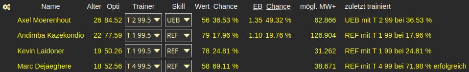
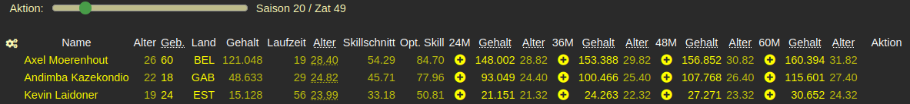
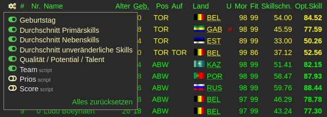
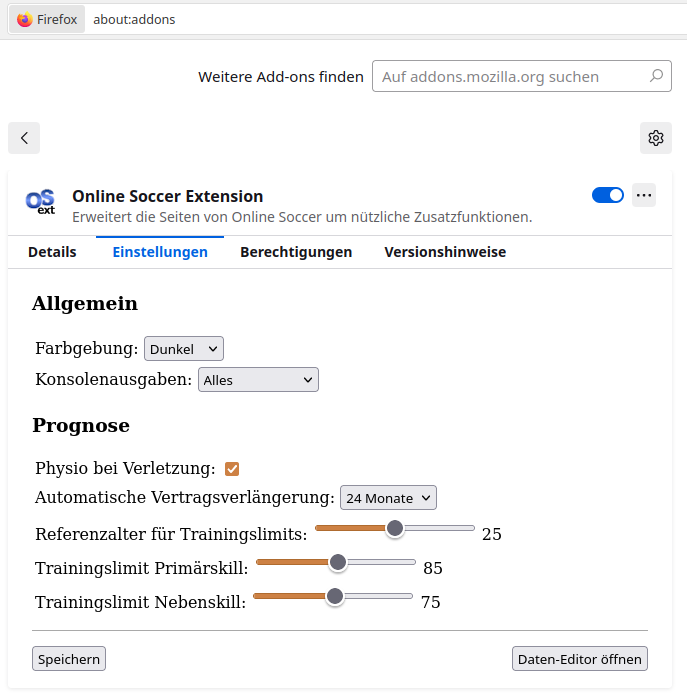

# Features

## Allgemeines

Nach dem Login werden alle für die Prognose relevanten Seiten im Hintergrund eingelesen. Währenddessen wird (rechts unten) ein Status eingeblendet. Sollte es zu einem Fehler kommen (z.B. durch Layout-Änderungen an den Original-Seiten), wird der Vorgang abgebrochen, und ein Fehler angezeigt. Dieser Initialisierungsvorgang wird einmalig pro Team und ZAT durchgeführt.

## Team-Prognose

Auf Basis der im Hintergrund vorliegenden Daten werden die zukünftigen Werte der Spieler prognostiziert. Diese Prognose steht auf den Seiten `Teamübersicht`, `Vertragsdaten` und `Einzelwerte` zur Verfügung.

Dabei wird unter anderem das eingestellte Training für die Skillvorschau, der Saisonplan für die Reduktion von Sperren und die Leihübersicht berücksichtigt. Zudem kann auf der Seite `Vertragsdaten` ein geplanter Schnelltransfer (Blitz-Symbol) bzw. eine Vertragsverlängerung (Plus-Symbol) in der Zukunft eingestellt werden. Diese Einstellungen werden bei Prognosen berücksichtigt, sowie am entsprechenden Zat auf der Startseite als `Geplante Aktionen (vor dem nächsten Zat)` angezeigt.

## Jugend-Prognose

Auch für die Jugendspieler werden die zukünftigen Werte der Spieler prognostiziert; hier gibt es auch einen Schalter für die Maximalvariante (Ende 18). Diese Prognose steht auf den Seiten `Teamübersicht`, `Spielereinzelwerte` und `Opt. Skill` zur Verfügung.

Für Jugendspieler kann auf der Seite `Opt. Skill` der Ziehzeitpunkt in der Zukunft inkl. Position und Vertragslänge eingestellt werden. Diese Einstellungen werden bei Prognosen berücksichtigt, sowie am entsprechenden Zat auf der Startseite als `Geplante Aktionen (vor dem nächsten Zat)` angezeigt.

## Saldo-Prognose

Auf der Teamseite `Saisonplan` wird eine Saldo-Prognose für die laufende und die kommende Saison berechnet. 

Dafür werden auf Basis der geplanten Begegnungen folgende Daten verwendet:

* Stadiondaten (auch in Arbeit befindliche Ausbauten) und die eingestellten Eintrittspreise je Bewerb (übersteuerbar) für die **Zuschauereinnahmen** und **Stadionkosten**
* Ligagröße und die aktuelle Plazierung (übersteuerbar) für die **Fernsehgelder** und die **Fanartikel** (inkl. Saisonabschlussprämie); optional werden auch die anteiligen Siegprämien auf Basis der Plazierung berücksichtigt
* Jugendspielerdaten für die **Jugendförderung** (berücksichtigt nur Spieler zwischen 13 und 18 sowie eingestellte Ziehtermine und Jugendschranken)
* Spielerdaten (Mannschaft und Jugend) für die monatlichen **Spielergehälter** (berücksichtigt eingestellte Schnelltransfers, Vertragsverlängerungen und Jugend-Ziehtermine)
* Leihdaten für die monatlichen **Leiheinnahmen bzw. -ausgaben**
* Trainerdaten für die monatlichen **Trainergehälter**
* Eingestellte Schnelltransfers für zusätzliche **Blitzerlöse**

Die Details zu jedem ZAT werden in einem Popup angezeigt, sobald sich der Mauszeiger über einem Saldowert befindet.

## Einstellungshilfe für das Training

Auf der Seite `Taining` wird der Einsatzbonus mit erhöhter Chance (nach Zugabgabe), ein möglicher Marktwertzuwachs bei erfolgreichem Training und das letzte Training angezeigt.

## Vertragsverlängerung

Auf der Seite `Verträge verlängern` wird das exakte Alter zum Ablauf des Vertrags angezeigt. Zudem kann eine Vertragsverlängerung (Plus-Symbol) in der Zukunft eingestellt werden. Diese Einstellung wird bei Prognosen berücksichtigt, sowie am entsprechenden Zat auf der Startseite als `Geplante Aktionen (vor dem nächsten Zat)` angezeigt.

## Einstellungen und Themes

Bei einige Tabellen wird ein Einstellungssymbol in der oberen Ecke angezeigt, mit dem das Layout eingestellt werden kann. Alle hinzugefügten Spalten (auch jene der Skripts) können ein- bzw- ausgeblendet werden. Per Drag & Drop (Tabellenspaltentitel) kann auch die horizontale Sortierung der Spalten angepasst werden.

In den Einstellungen (oder Optionen) der Erweiterung kann zwischen einem angepassten `OS-Blau` oder `Dark` Theme gewechselt werden. Ausserdem können Parameter für die Prognosen angepasst werden.

# Installation

Die Erweiterung wurde bisher mit (den aktuellen Versionen von) Firefox, Chromium und Edge (unter Xubuntu Linux) getestet, sollte aber mit allen Browsern, welche auf der Chrome Extension API basieren funktionieren.

Je nach verwendetem Browser kann die aktuelle Version über den entsprechenden Addon-Store installiert bzw. dem Browser hinzugefügt werden:

| Browser              | Link zur Extension im jeweiligen Store |
| -------------------- | ------- |
| Firefox              | https://addons.mozilla.org/de/firefox/addon/online-soccer-extension |
| Chrome/Chromium/Edge | https://chromewebstore.google.com/detail/online-soccer-extension/plhbikhfgkkommnghjaihagamgophofm |

Microsoft-Edge-Nutzer können die Extension über den Chrome-Store installieren. Dafür müssen lediglich Erweiterungen aus anderen Stores zugelassen werden (entweder über die Bestätigung einer entsprechenden Frage oder in den Erweiterungseinstellungen).

## Updates

Sobald eine neue Version veröffentlichet wurde, kümmert sich der Browser um die Aktualisierung (standardmäßig einmal täglich).

## Entwickleroption

Klonen des Repos https://github.com/rombau/osext2.git oder Herunterladen und Entpacken des Archivs https://github.com/rombau/osext2/archive/refs/heads/master.zip, und entpackte Erweiterung (Ordner `extension` bzw. `manifest.json`) laden.

**Chromium/Chrome** (chrome://extensions/)

**Firefox** (about:debugging#/runtime/this-firefox)

