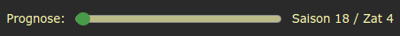

# Features

## Allgemeines

Nach dem Login werden alle für die Prognose relevanten Seiten im Hintergrund eingelesen. Währenddessen wird (rechts unten) ein Status eingeblendet.
Sollte es zu einem Fehler kommen (z.B. durch Layout-Änderungen an den Original-Seiten), wird der Vorgang abgebrochen, und ein Fehler angezeigt.
Dieser Initialisierungsvorgang wird einmalig pro Team und ZAT durchgeführt.

## Team-Prognose

Auf Basis der im Hintergrund vorliegenden Daten werden die zukünftigen Werte der Spieler prognostiziert. Diese Prognose steht auf den Seiten `Teamübersicht`, `Vertragsdaten` und `Einzelwerte` zur Verfügung.

Dabei wird unter anderem das eingestellte Training für die Skillvorschau, der Saisonplan für die Reduktion von Sperren und die Leihübersicht berücksichtigt.
Zudem kann auf der Seite `Vertragsdaten` ein geplanter Schnelltransfer bzw. eine Vertragsverlängerung in der Zukunft eingestellt werden.

## Jugend-Prognose

Auch für die Jugendspieler werden die zukünftigen Werte der Spieler prognostiziert; hier gibt es auch einen Schalter für die Maximalvariante (Ende 18). Diese Prognose steht auf den Seiten `Teamübersicht`, `Spielereinzelwerte` und `Opt. Skill` zur Verfügung.

Für Jugendspieler kann auf der Seite `Opt. Skill` der Ziehzeitpunkt in der Zukunft inkl. Position und Vertragslänge eingestellt werden.

## Saldo-Prognose

Auf der Teamseite `Saisonplan` wird eine Saldo-Prognose für die laufende und die kommende Saison berechnet. 

Dafür werden auf Basis der geplanten Begegnungen folgende Daten verwendet:

* Stadiondaten (auch in Arbeit befindliche Ausbauten) und die eingestellten Eintrittspreise je Bewerb (übersteuerbar) für die **Zuschauereinnahmen** und **Stadionkosten**
* Ligagröße und die aktuelle Position (übersteuerbar) für die **Fernsehgelder** und die **Fanartikel** (inkl. Saisonabschlussprämie)
* Jugendspielerdaten für die **Jugendförderung** (berücksichtigt nur Spieler zwischen 13 und 18 sowie eingestellte Ziehtermine und Jugendschranken)
* Spielerdaten (Mannschaft und Jugend) für die monatlichen **Spielergehälter** (berücksichtigt eingestellte Schnelltransfers, Vertragsverlängerungen und Jugend-Ziehtermine)
* Leihdaten für die monatlichen **Leiheinnahmen bzw. -ausgaben**
* Trainerdaten für die monatlichen **Trainergehälter**
* Eingestellte Schnelltransfers für zusätzliche **Blitzerlöse**

## Themes

In den Optionen der Erweiterung kann zwischen einem angepassten `OS-Blau` oder `Dark` Theme gewechselt werden.

# Installation

Die Erweiterung wurde bisher mit (den aktuellen Versionen von) Chromium und Firefox getestet, sollte aber mit allen Browsern, welche auf der Chrome Extension API basieren funktionieren.

## Firefox

Die aktuelle Version für Firefox kann über https://addons.mozilla.org/de/firefox/addon/online-soccer-extension/ installiert werden.

## Entwickleroption

Klonen des Repos https://github.com/rombau/osext2.git oder Herunterladen und Entpacken des Archivs https://github.com/rombau/osext2/archive/refs/heads/master.zip, und entpackte Erweiterung (Ordner `extension` bzw. `manifest.json`) laden.

**Chromium/Chrome** (chrome://extensions/)

**Firefox** (about:debugging#/runtime/this-firefox)

